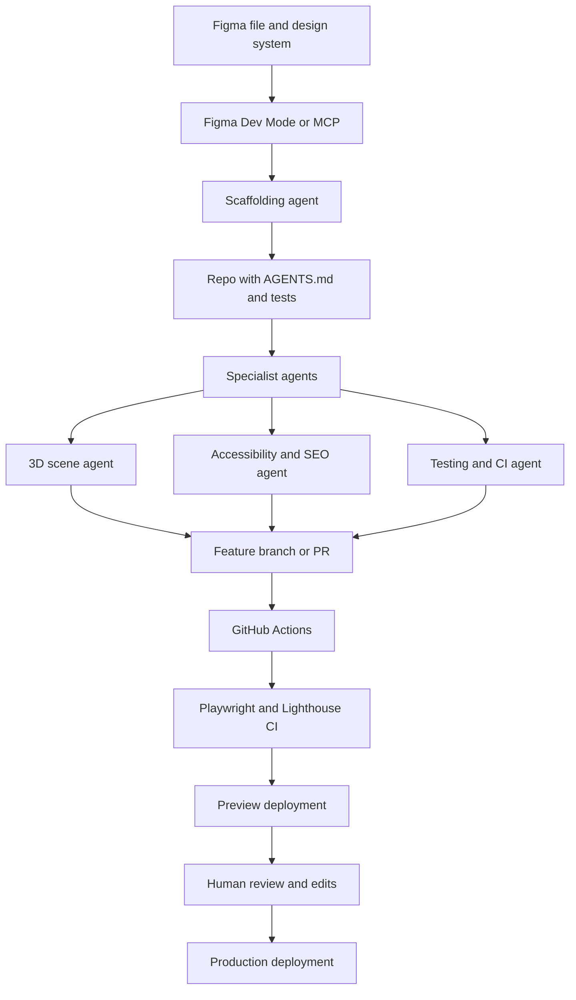
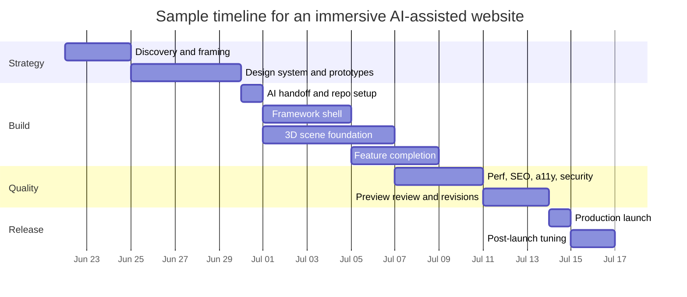

# Building High-Quality Coding-Vibe Websites with AI Agents

Download the Markdown file: [immersive_websites_ai_report.md](sandbox:/mnt/data/immersive_websites_ai_report.md)

## Executive summary

The strongest pattern for premium websites in 2026 is **server-first rendering plus selective enhancement**. In practical terms, that means using a framework that gives you SSR/SSG, metadata, image optimization, streaming, and good caching defaults, then layering in client-side motion and 3D only where they materially improve the experience. That approach aligns with the current direction of Next.js, Astro, SvelteKit, and modern web-platform guidance around Baseline, performance, and progressive enhancement. citeturn8search7turn1search8turn1search1turn1search6turn18search6turn15search0

For a modern **coding vibe**, the winning look is not simply “dark mode.” The more convincing pattern is a combination of dark or high-contrast surfaces, bold typography, monospace accents, visible grids, terminal-like microcopy, controlled glow or glass effects, experimental but legible navigation, and functional motion. Current design-trend coverage from Figma and Webflow repeatedly highlights 3D, motion, dark mode, bold type, AI-shaped workflows, and more expressive navigation as major directions, while Awwwards galleries show how those cues are being turned into live, high-polish interactive work. citeturn7search2turn7search6turn7search9turn7search20turn7search1turn7search5turn7search19

If the goal is a premium immersive site today, the most balanced default stack is usually **Next.js + React + React Three Fiber + Drei + Motion or GSAP + Tailwind CSS**, deployed on **Vercel** or **Cloudflare Workers**, with **Playwright + Lighthouse CI + GitHub Actions** enforcing quality. For content-heavy or editorial sites, **Astro** is often the better default because of its HTML-first model and selective islands. For simple product viewers or fallback 3D, **`<model-viewer>`** is often a better engineering decision than a bespoke WebGL scene. citeturn8search7turn1search1turn2search1turn13search10turn13search3turn10search18turn10search5turn10search4turn8search0

AI agents are now genuinely useful across the full lifecycle: Figma can provide design context through Dev Mode and MCP; coding agents such as Codex, Claude Code, GitHub Copilot, and Cursor can read repositories, edit files, run commands, and follow project-specific instructions; generation tools such as v0, Builder Visual Copilot, Replit Agent, and Lovable can scaffold interfaces or entire prototypes; and orchestration layers such as n8n, OpenAI Agents SDK, Anthropic MCP, or LangGraph can connect research, generation, testing, notification, and deployment into repeatable pipelines. citeturn4search2turn4search14turn19search2turn19search6turn4search1turn0search1turn5search4turn17search6turn5search7turn5search2turn6search0turn6search1turn6search2turn6search3

## What high-quality coding-vibe websites look like now

A practical reading of 2025–2026 design trends is that “coding vibe” websites work best when they combine **precision, atmosphere, and responsiveness**. Figma’s 2026 design and development trend roundups emphasize immersive 3D, experimental navigation, bold typography, dark mode, motion design, gamification, AI-driven workflows, server-first performance, and baseline-first browser features. Webflow’s 2025 and 2026 trend coverage points in a similar direction, especially around AI-assisted design, stronger visual expression, and more distinctive interactive experiences. citeturn7search2turn7search6turn7search9turn7search0

The design implication is that a “coding vibe” is best treated as a **system** rather than an ornament pack. It usually means a restrained palette, explicit layout structure, visible information density, code-window or dashboard metaphors, meaningful transitions, and motion that communicates state or narrative progress. That interpretation is a synthesis, but it is well supported by current trend surveys, Figma’s own “vibe coding” framing, and the contemporary gallery ecosystem around interactive and WebGL work. citeturn7search20turn7search2turn7search17turn7search1turn7search19

The browser platform is also finally good enough to deliver more “feel” with less framework overhead. The **View Transition API** is now a strong option for SPA and MPA transitions, and **scroll-driven animations** have matured substantially, though parts of the feature set still require progressive enhancement because support is not uniformly Baseline-wide across the most-used browsers. The right posture is still HTML first, enhancement second. citeturn18search0turn18search19turn18search1turn18search7turn18search21turn18search6

For immersive work, 3D should usually sit in one of three roles: a **hero scene** that sets tone, a **product or artifact viewer**, or a **narrative layer** tied to scroll or pointer input. The lowest-risk approach is to make 3D optional; the highest-risk mistake is to make 3D the only way to understand the page. W3C’s XR accessibility work and the newer semantic 3D accessibility effort both reinforce the need for equivalent information, multimodal access, and fallbacks outside the immersive layer. citeturn16search17turn3search17turn3search13turn16search9

| Practical trick | Why it works | Recommended implementation |
|---|---|---|
| Put real HTML text in the first viewport | Better LCP, better crawlability, and a usable shell if scripts or GPU work fail. citeturn15search6turn9search2turn1search10 | Render headline, summary, CTA, and navigation as normal HTML; lazy-load the scene after the shell is visible. |
| Treat 3D as enhancement, not prerequisite | Accessibility and compatibility are still better when the information exists outside the scene. citeturn3search17turn3search13turn16search17 | Provide screenshots, text descriptions, and non-WebGL navigation to the same content. |
| Use motion to explain state, not decorate everything | Motion improves UX when it clarifies change; it harms UX when it adds latency or discomfort. citeturn16search5turn15search2turn18search19 | Animate page changes, hierarchy, and state transitions; remove idle flourishes. |
| Prefer monospace as an accent font | Full-body monospace often hurts readability; monospace accents preserve the “technical” feel without sacrificing legibility. This is a design recommendation based on current-source synthesis. citeturn7search20turn7search2turn7search9 | Pair a grotesk or geometric primary face with mono for labels, stats, code snippets, and nav metadata. |
| Make reduced-motion mode first-class | Modern browser and animation docs explicitly recommend adapting or disabling motion when users request it. citeturn16search0turn16search1turn16search5 | Gate parallax, camera travel, scroll-linked transforms, and autoplay media behind reduced-motion checks. |
| Keep the canvas small in responsibility and strict in budget | WebGL is expensive on weaker devices, and R3F/MDN both recommend conservative rendering practice. citeturn2search1turn2search2turn2search5 | Limit draw calls, compress assets, render on demand where possible, and degrade effects on low-end devices. |

## Recommended stack and tool comparisons

The main architectural decision is whether the site is **application-led**, **content-led**, or **scene-led**. Application-led sites usually benefit from Next.js; content-led sites often benefit from Astro; heavier real-time experiences may justify Babylon.js or PlayCanvas; and simple product visualization often benefits from `<model-viewer>`. citeturn8search7turn1search1turn13search0turn13search23turn13search3

### Frameworks and rendering options

| Stack | Best for | Rendering strengths | Main trade-offs | Learning curve |
|---|---|---|---|---|
| **Next.js 15/16** citeturn8search7turn1search8turn9search0turn9search7 | Premium React sites, app-marketing hybrids, personalized experiences | Full-stack React, metadata, image optimization, streaming, and PPR/cache-component patterns | More moving parts and more runtime choices to govern | Medium |
| **Astro** citeturn1search1turn1search5turn9search5turn9search17 | Content-rich marketing sites, docs, editorial brands | HTML-first delivery, strong content model, islands/server islands, excellent static performance | Best when most of the page is content, not app state | Low–medium |
| **SvelteKit** citeturn1search6turn1search2turn1search10turn1search18 | Lean interactive sites with strong performance goals | SSR/SSG support, smaller client bundles, flexible adapters | Smaller ecosystem than React | Medium |
| **React Router / Remix lineage** citeturn1search3turn1search7turn1search15turn1search19 | Data-heavy apps that benefit from nested routing and streaming UX | Strong loader/action model, streaming, optimistic UI guidance | Less turnkey for marketing-heavy teams than Next.js | Medium |

### 3D engines and immersive layers

| Engine or layer | Best use | Pros | Cons | Cost | Learning curve |
|---|---|---|---|---|---|
| **Three.js** citeturn13search10turn13search6 | Custom visual storytelling, branded 3D, shaders, hero scenes | Most flexible ecosystem, battle-tested, large knowledge base | Lower-level; more manual architecture | Free / open source | Medium–high |
| **React Three Fiber + Drei** citeturn2search1turn2search13 | React-based immersive sites | Three.js power with React composition and strong helpers | Requires solid React and 3D mental models | Free / open source | Medium–high |
| **Babylon.js** citeturn13search0 | Full real-time 3D apps, immersive configurators, advanced rendering | More batteries-included engine model | Heavier engine-style abstractions than many marketing sites need | Free / open source | High |
| **PlayCanvas** citeturn13search23turn13search17 | Larger 3D productions, visual editing, splats/WebGPU experimentation | Strong editor-centric workflow and modern graphics focus | Smaller ecosystem than Three.js for front-end storytelling patterns | Engine open source; platform/commercial options vary | High |
| **`<model-viewer>`** citeturn13search3turn13search7turn2search7 | Product viewers, AR demos, robust fallback 3D | HTML-first, simple, accessible description hooks, mobile AR modes on supported devices | Not designed for bespoke scene logic or experimental interaction | Free / open source | Low |

### Motion and interaction layers

| Library | Best use | Notes | Cost | Learning curve |
|---|---|---|---|---|
| **Motion** citeturn12search1turn12search5turn16search15 | Page transitions, gestures, layout animation in React | Lightweight, production-oriented, accessibility-aware APIs | Free / MIT | Low–medium |
| **GSAP + ScrollTrigger** citeturn12search0turn12search20 | Narrative scroll choreography and timeline-heavy sequences | Extremely capable for high-end interactive storytelling | Licensing/plugin fit should be checked against your use case | Medium |
| **Lenis** citeturn12search6turn12search2 | Smooth-scroll layer for art-directed experiences | Lightweight and common in WebGL scroll storytelling | Should be used carefully to avoid fighting browser expectations | Free / open source | Low |
| **react-spring** citeturn12search3turn12search11turn12search19 | Physics-driven motion, including R3F scenes | Excellent when you want fluid spring behavior without re-rendering everything | More conceptual than prop-based motion libraries | Free / open source | Medium |

### AI agents and website-building tools

Public pricing changes frequently. The values below are **indicative public pricing visible in official pricing pages in June 2026**. citeturn11search3turn11search4turn11search1turn21search0turn5search8turn5search11turn5search6turn20search15

| Tool | Category | Best use | Strengths | Main caution | Indicative cost | Learning curve |
|---|---|---|---|---|---|---|
| **Codex** citeturn4search1turn4search7turn19search18turn11search3 | Coding agent | Implementing features, reviewing code, parallel subagents | Local CLI and cloud modes, AGENTS.md, skills, subagents | Best results require explicit repo rules and tests | Included across ChatGPT plans; Go starts at $8/mo | Medium |
| **Claude Code** citeturn19search2turn19search8turn19search16turn11search6turn11search14 | Coding agent | Repo-wide coding, terminal workflows, persistent project memory | Strong agent loop, skills, CLAUDE.md memory, CLI/IDE/browser support | Needs governance around command execution and file access | Included in Claude Pro at $20/mo monthly; higher Max tiers offer more usage | Medium |
| **GitHub Copilot** citeturn4search6turn19search6turn19search13turn11search4 | IDE agent + cloud agent | In-editor iteration plus GitHub-native implementation/PR flows | Agent mode, cloud agent, custom agents | Credit-based usage requires governance | Pro $10/mo, Pro+ $39/mo, Business $19/seat/mo | Low–medium |
| **Cursor** citeturn0search1turn11search1turn11search9 | Agentic IDE | Fast editing, codebase search, multi-file refactors | Strong agentic IDE ergonomics and team rules/skills | Pricing and model usage can get complex | Teams from $40/user/mo monthly | Low–medium |
| **Figma Dev Mode + MCP** citeturn4search2turn4search14turn17search15turn21search0 | Design-to-dev context | Giving coding agents precise design context | Accurate specs, MCP server, excellent handoff | Works best when Figma files are structured well | Professional Dev seat $12/mo; higher-tier Dev seats vary by plan | Low |
| **Builder Visual Copilot** citeturn17search6turn17search3turn5search9 | Design-to-code | Converting Figma frames into framework code | Multi-framework support, component mapping, fast handoff | Generated code still needs review and refactoring | Free to start; paid plans scale by seats/usage | Low–medium |
| **v0** citeturn5search4turn5search12turn5search8 | Prompt-to-app builder | Fast React/full-stack scaffolding and live iteration | Excellent for greenfield prototypes and production-oriented scaffolds | Best for acceleration, not for replacing architecture judgment | Free; Team $30/user/mo; Business $100/user/mo | Low |
| **Replit Agent** citeturn5search7turn5search19turn5search11 | Prompt-to-app builder | End-to-end app and website prototyping with deployment | Very fast ideation and deployment in one place | Runtime and architecture choices should still be reviewed | Starter free; Core from $20/mo billed annually | Low |
| **Lovable** citeturn5search2turn5search6turn5search18 | Prompt-to-app builder | Startup landing pages and simple product prototypes | Great speed for early concepts | Hand off to a code-first stack before complexity grows | Free; Pro $25/mo; Business $50/mo | Low |
| **n8n** citeturn6search3turn6search23turn20search0turn20search15 | Automation/orchestration | Connecting research, build, QA, notifications, and deployment | AI Agent node, many integrations, flexible automation graph | Adds maintenance overhead if workflows are trivial | Cloud from €20/mo for 2.5k executions; unlimited users/workflows | Medium |

My strongest recommendation is to use **one design-context tool, one coding agent, and one orchestration layer**. Too many overlapping agents creates diff noise, inconsistent conventions, and duplicated cost. A practical premium setup is **Figma Dev Mode or MCP → Codex or Claude Code → GitHub Actions/Playwright/Lighthouse → Vercel or Cloudflare**. citeturn4search2turn4search14turn19search0turn19search2turn10search4turn10search2turn10search5turn10search3turn8search0

## AI-agent workflows from design to deployment

The best AI workflow is not “prompt once and ship.” It is a staged handoff where each phase reduces ambiguity. Designers define intent and reusable components in Figma; design context is exposed through Dev Mode or MCP; a coding agent scaffolds routes, components, and animation structure; specialized skills or subagents handle 3D, accessibility, SEO, and testing; CI validates behavior and performance; and preview deployments capture stakeholder feedback before anything reaches production. That staged model maps closely to how current coding agents and orchestration frameworks are designed to work. citeturn4search2turn4search14turn19search1turn19search11turn6search0turn6search2turn6search10



A robust repository should give agents durable instructions in **`AGENTS.md`** or the tool’s equivalent. Codex documents `AGENTS.md` as repository-level guidance that travels with the repo; GitHub Copilot supports `AGENTS.md`-based custom instructions; and Claude Code uses `CLAUDE.md` plus memory and skills to keep behavior persistent across sessions. The highest-value contents are always the same: package manager, naming conventions, where generated code may live, which commands to run, which budgets matter, and what counts as done. citeturn19search0turn19search19turn19search17turn19search16turn19search8

A minimal example is enough to create leverage:

```md
# AGENTS.md

## Stack rules
- Use Next.js App Router with TypeScript.
- Prefer Server Components unless interactivity clearly requires a Client Component.
- Use Tailwind CSS for layout and tokens.
- Keep WebGL code inside `components/scene/*`.

## Quality gates
- pnpm lint
- pnpm test
- pnpm test:e2e
- pnpm lhci

## Performance budgets
- Route JS should stay lean.
- LCP target under 2.5s.
- INP target under 200ms.
- CLS target under 0.1.

## Accessibility
- Respect reduced motion.
- Every 3D scene needs equivalent text and a static fallback image.

## Review expectations
- Do not add new dependencies without justification.
- Prefer editing existing components before creating new abstractions.
- Include tests for interaction changes.
```

That style of instruction matters because it converts fuzzy taste into enforceable policy. It also reduces the main front-end failure mode of agentic development: visually impressive output with inconsistent structure, weak performance discipline, and missing test coverage. citeturn19search0turn19search7turn19search15

## Step-by-step recipe and code examples

A reliable recipe for an immersive 3D site with an AI agent starts by defining the non-negotiables before prompting: content architecture, design tokens, fallback behavior, performance budgets, and which parts of the site truly need 3D. Then pass both the design context and the repo rules to the agent. That workflow consistently produces better output than a single “build me a cinematic site” prompt. citeturn4search2turn19search19turn19search7

The next step is to scaffold the shell before the scene. Ask the agent to build routes, metadata, layout, typography, and responsive structure **before** it touches WebGL. This preserves SEO and crawlability, keeps the project testable early, and gives you a better visual baseline for later immersive work. It also matches the current documentation emphasis in Next.js, Astro, and Google Search guidance: meaningful HTML first, enhancement second. citeturn9search0turn9search8turn9search2turn1search10

Then isolate the 3D experience in a dedicated scene component with explicit loading and performance constraints. React Three Fiber’s documentation recommends bounded DPR, conservative rendering, and avoiding unnecessary React state churn inside render loops. citeturn2search1turn2search5

A compact React/Next.js hero scene:

```tsx
'use client'

import { Canvas } from '@react-three/fiber'
import { Environment, Float, Html, useGLTF } from '@react-three/drei'
import { Suspense } from 'react'

function Orb() {
  const { scene } = useGLTF('/models/orb-compressed.glb')
  return <primitive object={scene} scale={1.2} position={[0, -0.25, 0]} />
}

export function HeroScene() {
  return (
    <Canvas
      dpr={[1, 1.5]}
      frameloop="demand"
      camera={{ position: [0, 0, 4], fov: 42 }}
    >
      <ambientLight intensity={0.6} />
      <directionalLight position={[2, 2, 3]} intensity={2} />
      <Suspense
        fallback={
          <Html center>
            <span className="text-sm opacity-70">Loading scene…</span>
          </Html>
        }
      >
        <Float speed={1.2} rotationIntensity={0.35} floatIntensity={0.45}>
          <Orb />
        </Float>
        <Environment preset="city" />
      </Suspense>
    </Canvas>
  )
}
```

The important parts are not the exact light values; they are the **bounded DPR**, **isolated scene component**, and **non-blocking fallback**. Use this for hero scenes, but lazy-load the component below the text shell whenever you want the page to become useful sooner. citeturn2search1turn2search5turn15search6

Before polishing a scene, harden the asset pipeline. The modern web standard remains **glTF/GLB**, ideally with geometry compression plus modern texture compression. Khronos describes glTF as a format optimized for efficient transmission and loading, Three.js exposes Meshopt/Draco/KTX2 hooks in `GLTFLoader`, and glTF-Transform gives you a practical CLI to inspect and optimize models before they ever reach production. citeturn14search1turn14search2turn14search0turn14search4

A practical Three.js loader setup:

```ts
import * as THREE from 'three'
import { GLTFLoader } from 'three/addons/loaders/GLTFLoader.js'
import { DRACOLoader } from 'three/addons/loaders/DRACOLoader.js'
import { KTX2Loader } from 'three/addons/loaders/KTX2Loader.js'
import { MeshoptDecoder } from 'meshoptimizer'

const renderer = new THREE.WebGLRenderer({ antialias: true, alpha: true })
const draco = new DRACOLoader().setDecoderPath('/draco/')
const ktx2 = new KTX2Loader().setTranscoderPath('/basis/').detectSupport(renderer)

const loader = new GLTFLoader()
loader.setDRACOLoader(draco)
loader.setKTX2Loader(ktx2)
loader.setMeshoptDecoder(MeshoptDecoder)

loader.load('/models/orb.glb', (gltf) => {
  gltf.scene.traverse((obj) => {
    if ((obj as THREE.Mesh).isMesh) obj.castShadow = true
  })
  scene.add(gltf.scene)
})
```

That combination matters because it makes the loader “real-world ready” instead of “demo ready”: Draco or Meshopt reduce geometry cost, and KTX2 improves GPU texture delivery. In many projects, one glTF optimization pass is the difference between a delightful accent and a broken mobile experience. citeturn2search19turn2search0turn14search13turn14search8turn14search11

Choose SSG, SSR, or a hybrid route intentionally. Stable marketing content, case studies, and docs should usually be statically generated or incrementally regenerated; personalized or frequently changing content should stay dynamic. Next.js, Astro, and SvelteKit all document this distinction clearly, and the performance/SEO rationale remains strong. citeturn9search0turn9search4turn1search8turn1search1turn1search2turn1search10

Example of a Next.js route that leans static while keeping metadata and structured data strong:

```tsx
// app/work/[slug]/page.tsx
import type { Metadata } from 'next'

export const revalidate = 3600

export async function generateStaticParams() {
  const slugs = await fetch('https://example.com/api/work-index').then((r) => r.json())
  return slugs.map((slug: string) => ({ slug }))
}

export async function generateMetadata(
  { params }: { params: Promise<{ slug: string }> }
): Promise<Metadata> {
  const { slug } = await params
  const item = await fetch(`https://example.com/api/work/${slug}`).then((r) => r.json())

  return {
    title: item.title,
    description: item.summary,
    openGraph: {
      title: item.title,
      description: item.summary,
      images: [item.ogImage],
    },
  }
}

export default async function WorkPage(
  { params }: { params: Promise<{ slug: string }> }
) {
  const { slug } = await params
  const item = await fetch(`https://example.com/api/work/${slug}`).then((r) => r.json())

  const jsonLd = {
    '@context': 'https://schema.org',
    '@type': 'CreativeWork',
    name: item.title,
    description: item.summary,
  }

  return (
    <article className="prose prose-invert mx-auto">
      <script
        type="application/ld+json"
        dangerouslySetInnerHTML={{ __html: JSON.stringify(jsonLd) }}
      />
      <h1>{item.title}</h1>
      <p>{item.summary}</p>
    </article>
  )
}
```

This pattern combines static generation, metadata, and JSON-LD. It is a good default for studio, portfolio, and product-story pages because it protects discoverability while keeping the rendering model easy to reason about. citeturn9search0turn9search4turn9search8turn9search10

Finally, prompt the agent iteratively rather than asking for one monolithic answer. A short prompt sequence works better than a giant brief:

```txt
Prompt 1:
Create the Next.js app shell, design tokens, typography system, responsive layout, and metadata.
Do not add WebGL yet.

Prompt 2:
Using the Figma MCP context and AGENTS.md, implement the homepage hero and work index.
Prefer Server Components and keep client JS minimal.

Prompt 3:
Add an optional R3F hero scene behind the hero copy.
Use glTF, bounded DPR, reduced-motion fallback, and lazy loading.

Prompt 4:
Create Playwright tests for nav and CTA flow, then add Lighthouse CI budgets.
```

That staged approach matches how Codex skills, Copilot agent mode, Claude Code, and orchestration frameworks are intended to be used: multistep, tool-using, and reviewable rather than one-shot. citeturn19search1turn19search11turn4search6turn4search18turn19search2

## Quality engineering for performance SEO accessibility security and CI/CD

Performance is the first hard constraint. Current Core Web Vitals guidance still centers on **LCP**, **INP**, and **CLS**, with “good” targets of **LCP ≤ 2.5 s**, **INP ≤ 200 ms**, and **CLS ≤ 0.1** at the 75th percentile. Those targets are strict enough that unbounded canvas work, oversized 3D assets, and motion-heavy first paint will show up quickly as UX and business problems. citeturn15search6turn15search5turn15search7turn15search0

For immersive sites, the most dependable performance wins are straightforward: load text before scenes, keep draw calls down, reuse geometry and materials, prefer instancing, avoid state churn inside frame loops, compress models and textures, and in plain WebGL follow MDN’s guidance on batching, reducing back-buffer cost, avoiding blocking API calls, and respecting device limits. When the requirement is only “show an object well,” prefer `<model-viewer>` over a custom scene. citeturn2search5turn2search1turn2search2turn14search0turn13search3

SEO for premium visual sites is simpler than it looks. The basics still matter: render meaningful HTML, add metadata and OG images, generate structured data where appropriate, define canonical URLs and sitemaps, and keep the content comprehensible without client-side execution. Next.js and Astro both expose strong primitives for this, and Google’s Search documentation continues to emphasize useful, distinctive content over gimmicks. citeturn9search0turn9search4turn9search8turn9search5turn9search1turn9search2turn9search18

Accessibility is where many immersive sites still fail. Respect `prefers-reduced-motion`, keep keyboard-operable navigation outside the canvas, clearly label controls, provide equivalent text for scene content, and treat the 3D layer as **one representation** of the information rather than the only representation. W3C XR accessibility guidance and the newer semantic 3D accessibility work both point toward multimodal, equivalent access. citeturn16search0turn16search1turn16search5turn3search17turn3search13turn16search17

Security deserves the same attention as aesthetics. A solid baseline for modern sites is a restrictive **Content Security Policy**, explicit security headers, narrow image allowlists, dependency hygiene, and protected preview environments. Next.js documents CSP and header configuration directly, while MDN and OWASP both provide current guidance on CSP and secure headers. citeturn3search2turn3search22turn3search14turn3search6turn3search18turn9search3

A simple Next.js hardening example:

```ts
// next.config.ts
import type { NextConfig } from 'next'

const csp = [
  "default-src 'self'",
  "script-src 'self' 'unsafe-inline' 'unsafe-eval'",
  "style-src 'self' 'unsafe-inline'",
  "img-src 'self' data: https:",
  "font-src 'self' https: data:",
  "connect-src 'self' https:",
  "frame-ancestors 'none'",
  "base-uri 'self'",
  "object-src 'none'",
].join('; ')

const nextConfig: NextConfig = {
  images: {
    remotePatterns: [new URL('https://images.example.com/**')],
  },
  async headers() {
    return [
      {
        source: '/(.*)',
        headers: [
          { key: 'Content-Security-Policy', value: csp },
          { key: 'Referrer-Policy', value: 'strict-origin-when-cross-origin' },
          { key: 'X-Content-Type-Options', value: 'nosniff' },
          { key: 'X-Frame-Options', value: 'DENY' },
          {
            key: 'Strict-Transport-Security',
            value: 'max-age=63072000; includeSubDomains; preload',
          },
        ],
      },
    ]
  },
}

export default nextConfig
```

The exact CSP should match your analytics, fonts, CMS, and media stack, but the principle is stable: start restrictive and open only what is required. Also protect preview deployments if the project includes unreleased client work. citeturn3search2turn3search14turn3search18turn10search23

Testing and CI/CD should be non-negotiable. Playwright gives you reliable cross-browser E2E coverage plus accessibility-testing support; React Three Fiber has dedicated testing utilities; Lighthouse CI can enforce performance budgets; and GitHub Actions ties it all together into repeatable workflows. Vercel and Cloudflare both support rapid preview deployment patterns, which is especially valuable for art direction and stakeholder review on immersive sites. citeturn3search3turn10search18turn2search9turn10search5turn10search4turn10search3turn8search0

A compact GitHub Actions pipeline:

```yaml
name: quality

on:
  pull_request:
  push:
    branches: [main]

jobs:
  test-and-audit:
    runs-on: ubuntu-latest
    steps:
      - uses: actions/checkout@v4

      - uses: actions/setup-node@v4
        with:
          node-version: 20
          cache: pnpm

      - run: corepack enable
      - run: pnpm install --frozen-lockfile
      - run: pnpm lint
      - run: pnpm test
      - run: pnpm exec playwright install --with-deps
      - run: pnpm test:e2e

      - run: pnpm build
      - run: pnpm start &

      - name: Lighthouse CI
        uses: treosh/lighthouse-ci-action@v12
        with:
          urls: |
            http://localhost:3000
            http://localhost:3000/work
          uploadArtifacts: true
          temporaryPublicStorage: true
```

That pipeline is intentionally conservative. The more expressive and experimental the front end becomes, the more boring and reliable the delivery pipeline should be. citeturn10search8turn10search2turn3search7turn10search1

## Skills roadmap, sample project plan, and source list

### Skills to learn from beginner to advanced

| Priority | Skill | Why it matters |
|---|---|---|
| Beginner | **HTML semantics, accessibility basics, CSS layout, responsive design** | Every successful premium site still depends on durable HTML, readable typography, and accessible navigation. citeturn3search1turn9search2turn9search14 |
| Beginner | **JavaScript/TypeScript fundamentals** | You need enough language fluency to review, correct, and constrain AI-generated code. citeturn6search20turn19search4 |
| Beginner | **React and a server-first framework** | The rendering model is the backbone of performance and maintainability. citeturn8search7turn1search1turn1search6 |
| Intermediate | **Design systems and Figma Dev Mode/MCP** | The highest-leverage AI workflow improvement is better design-to-code context. citeturn4search2turn17search15turn21search0 |
| Intermediate | **Animation systems** | Motion, GSAP, and browser-native transitions create premium feel without relying entirely on 3D. citeturn12search5turn12search0turn18search19 |
| Intermediate | **Core Web Vitals and profiling** | Premium visual sites fail quickly if you cannot diagnose LCP, INP, CLS, and scene bottlenecks. citeturn15search6turn15search5turn15search7turn2search2 |
| Intermediate | **glTF pipeline and asset optimization** | Immersive work is often won or lost in asset prep. citeturn14search1turn14search0turn2search19turn14search13 |
| Advanced | **Three.js / R3F scene architecture** | This unlocks bespoke identity, richer interactivity, and higher-end storytelling. citeturn13search10turn2search13turn2search1 |
| Advanced | **Agent orchestration and repo-level AI governance** | Production AI workflows depend on instruction management, evaluation, and controlled automation. citeturn6search0turn6search2turn6search3turn19search19 |
| Advanced | **Security, CI/CD, and observability** | High-end sites still need hardening, repeatable deployment, and measurable reliability. citeturn3search6turn10search4turn10search3turn20search8 |

### Sample project plan

The following plan assumes no specific team size and is intended as a **single-track estimate**. Parallel work can shorten calendar time significantly.

| Milestone | Example tasks | Estimated time |
|---|---|---|
| Discovery and creative framing | references, IA, moodboards, success metrics | 1.5–3 days |
| Design system and prototypes | tokens, components, responsive key templates | 3–6 days |
| AI-ready handoff setup | Dev Mode/MCP, AGENTS.md, repo scaffolding, CI skeleton | 0.5–1 day |
| Framework shell | routes, metadata, nav, footer, content plumbing | 2–4 days |
| Immersive scene foundation | glTF pipeline, scene setup, motion system, fallbacks | 3–7 days |
| Feature completion | sections, case studies, forms, analytics, preview deploys | 2–5 days |
| Quality hardening | Playwright, Lighthouse CI, accessibility, security, SEO | 2–4 days |
| Launch and tuning | production deploy, CWV measurement, cleanup backlog | 1–2 days |



### Selected primary and notable sources

**Frameworks and rendering**  
Next.js documentation and release material on App Router, metadata, image optimization, caching, and PPR. citeturn8search7turn1search8turn9search0turn9search7turn1search4  
Astro documentation on content-driven delivery, adapters, sitemap, content collections, and configuration. citeturn1search1turn1search5turn9search1turn9search5turn9search17  
SvelteKit documentation on SSR/SSG and adapters. citeturn1search6turn1search2turn1search18  
React Router / Remix documentation on streaming and optimistic UI. citeturn1search3turn1search15turn1search19

**Immersive web and 3D**  
Three.js docs and manual. citeturn13search10turn13search6  
React Three Fiber docs on loading models, performance scaling, pitfalls, and testing. citeturn2search1turn2search5turn2search9turn2search13  
Khronos glTF, glTF-Transform, Meshopt, and Draco references. citeturn14search1turn14search0turn14search6turn14search7  
`<model-viewer>` documentation. citeturn13search3turn2search7

**AI agents and design-to-code**  
Codex docs on CLI, cloud, skills, subagents, AGENTS.md, and customization. citeturn4search1turn4search7turn19search0turn19search1turn19search11turn19search19  
Claude Code docs on overview, skills, memory, and customization. citeturn19search2turn19search8turn19search16turn19search12  
GitHub Copilot docs/blog on agent mode, cloud agent, and custom agents. citeturn4search6turn19search6turn19search13turn4search18  
Figma Dev Mode, MCP, Figma Make, Figma Sites, and the Figma design agent. citeturn4search2turn4search14turn17search1turn17search0turn17search5  
Builder Visual Copilot documentation and product pages. citeturn17search6turn17search3  
n8n and OpenAI/Anthropic/LangGraph orchestration resources. citeturn6search0turn6search1turn6search2turn6search3

**Quality engineering**  
web.dev on Core Web Vitals, thresholds, and optimization. citeturn15search0turn15search5turn15search6turn15search7  
Google Search Central SEO guidance. citeturn9search2turn9search10turn9search22  
W3C accessibility and XR sources. citeturn3search1turn3search17turn3search13turn16search17  
OWASP, MDN, and Next.js security guidance. citeturn3search2turn3search6turn3search14turn3search18  
Playwright, Lighthouse CI, GitHub Actions, and deployment docs. citeturn3search3turn10search5turn10search4turn10search3